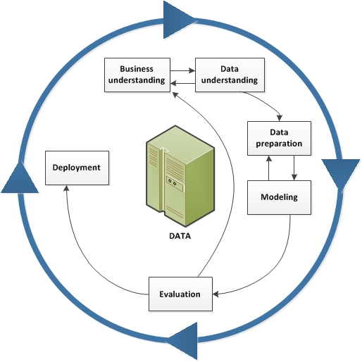
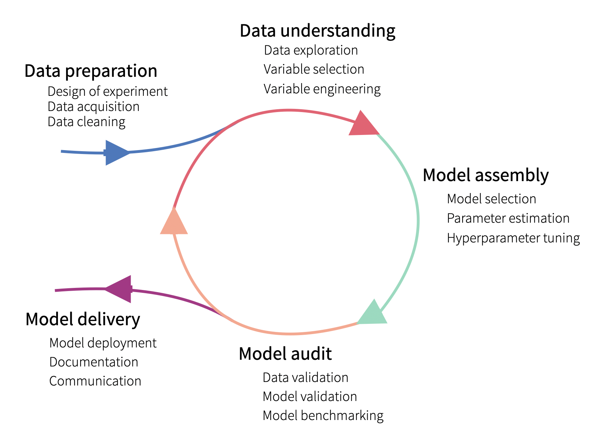

# Model Development

**Learning objectives:**

- THESE ARE NICE TO HAVE BUT NOT ABSOLUTELY NECESSARY


## Modiling Approaches {-}

- **Explanatory Modelling**: Models are applied for inferential purposes like testing an hypotheses.

- **Predictive Modelling**: Models are used for the purpose of predicting the value of a new or future observation. 


## Predict Modiling Examples {-}

- Creating a model for **scoring risks of transactions** in a large financial company _can take several months_

- Creating a model for roughly predict **the demand for deliveries** in a small pizza-delivery chain can be _quickly updated or even discarded_, without major consequences.


## Model-development Process {-}

Standardization can help to:

- Plan resources needed to develop and maintain a model
- Make sure that no important steps are missed when developing the model

## CRISP-DM: _Cross-industry Standard Process for Data Mining_ {-}

**It is a tool-agnostic procedure**



## Lifecycle of a Predictive Model {-}




## MDP: _Model-development Process_ {-}

Consecutive iterations are not identical because the knowledge increases during the process and consecutive iterations are performed with different goals in mind

- The five phases, present in CRIPSP-DM, are shown in the rows
- A single bar in each row represents a number of resources (for instance, a week-worth workload) 


## Meeting Videos {-}

### Cohort 1 {-}

`r knitr::include_url("https://www.youtube.com/embed/URL")`

<details>
<summary> Meeting chat log </summary>

```
LOG
```
</details>
