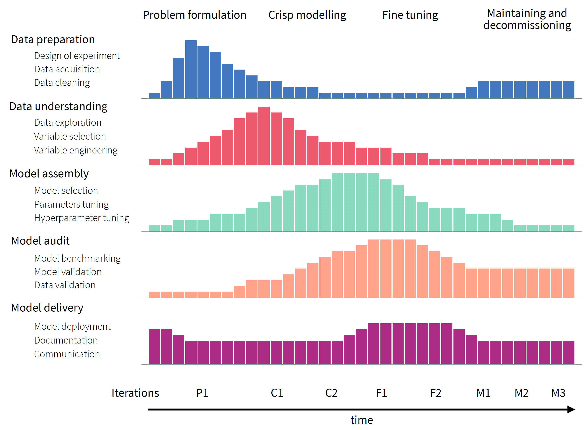
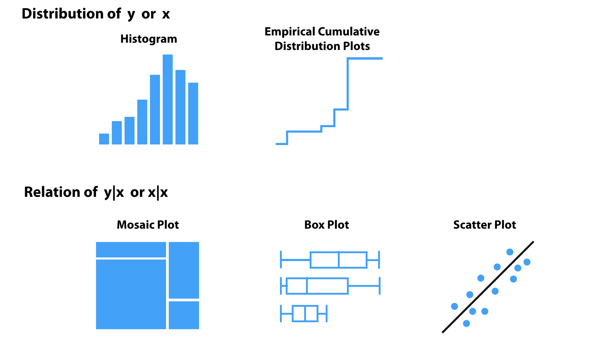

# Model Development

**Learning objectives:**

- THESE ARE NICE TO HAVE BUT NOT ABSOLUTELY NECESSARY


## Modiling Approaches {-}

- **Explanatory Modelling**: Models are applied for inferential purposes like testing an hypotheses.

- **Predictive Modelling**: Models are used for the purpose of predicting the value of a new or future observation. 


## Predict Modiling Examples {-}

- Creating a model for **scoring risks of transactions** in a large financial company _can take several months_

- Creating a model for roughly predict **the demand for deliveries** in a small pizza-delivery chain can be _quickly updated or even discarded_, without major consequences.


## Model-development Process {-}

Standardization can help to:

- Plan resources needed to develop and maintain a model
- Make sure that no important steps are missed when developing the model

## CRISP-DM: _Cross-industry Standard Process for Data Mining_ {-}

**It is a tool-agnostic procedure**


## Lifecycle of a Predictive Model {-}


{width=60% height=80% fig-align="center"}

## MDP: _Model-development Process_ {-}

Consecutive iterations are not identical because the knowledge increases during the process and consecutive iterations are performed with different goals in mind

- The five phases, present in CRIPSP-DM, are shown in the rows
- A single bar in each row represents a number of resources (for instance, a week-worth workload) 
- The stages are indicated at the top of the diagram
  
{width=60% height=80% fig-align="center"}

## MDP: _Model-development Process_ {-}

- _Stage 1: Problem Formulation_
  - Defining datasets that will be used for training and validation
  - Deciding which performance measures will be used for the evaluation of the performance of the final model
  
- _Stage 2: Crisp Modelling_
  - Focuses on the creation of first versions
  - Defines how complex the models needs to be

- _Stage 3: Fine-tuning_
  - Focuses on improving the initial version(s) of the model
  - Selecting the best one according to the pre-defined metrics

- _Stage 4: Maintenance and Decommissioning_
  - Monitoring the performance of the model after its implementation


## Notation {-}

|**Description**|**Example**|**Meaning**|
|:--------------|:---------:|:----------|
|Capital letters|$X$ or $Y$ |Scalar random variables|
|Lower case letters|$x$ or $y$ |Observed values of variables|
|Underline capital letters|$\underline{X}$|Matrix|
|Underline lower case letters|$\underline{x}$|Column vector|
|Prime|$\underline{x}'$|Transposition|


## Notation {-}

|**Description**|**Example**|**Meaning**|
|:--------------|:---------:|:----------|
|E function|$E(Y)$|Expected (mean) value|
|Var function|$Var(Y)$|Variance of a random variable|
|Subscript|$E_{Y|X=x}(Y)$ <br> <br> $E_{Y|x}(Y)$ <br> <br> $E_Y(Y|X = x)$|Indicate the distribution used to compute the parameters. <br> <br> In this example, the equation represents the mean of $Y$ given that random variable $X$ assumes the value of $x$|

## Notation {-}

|**Description**|**Example**|**Meaning**|
|:--------------|:---------:|:----------|
|Letter y|$Y$|Represent the dependent (random) variable (number or binary indicator)|
|Lower case i|$y_i$|Identify one specific observation|
|Lower case n|$n$|Number of observations in the data available for modelling|
|Lower case p|$p$|Number of explanatory variables|
|Caligraphic X|$\mathcal{X} = \mathcal{R}^p$ <br> <br> $\underline{x}_i \ni \mathcal{X}$|P-dimensional space|
|An asterisk in the subscript|$x_*$|An observation of interest|


## Notation {-}

|**Description**|**Example**|**Meaning**|
|:--------------|:---------:|:----------|
|Lower case j|$\underline{x}^j$|Number of coordinate of vector $\underline{x}$|
|Lower case i|$\underline{x}_i = (x^1_i, \dots, x^p_i)'$|Identify one specific observation of a (column) vector of the explanatory variables|
|Parenthesis to apply power|$\left(  x_i^j \right)^2$||
|Caligraphic J|$x^\mathcal{J}$|Denotes a subset of indices|
|Negative Mathematical J|$x^{-\mathcal{J}}$|Removing the $j$-th coordinate|
|$=z$|$\underline{x}^{j|=z}=(x^1, \dots, x^{j-1},   z, x^{j+1}, \dots, x^p)'$|Replaces the $j$-th component of vector $\underline{x}$ with $z$|


## Notation {-}

|**Description**|**Example**|**Meaning**|
|:--------------|:---------:|:----------|
|$*j$|$\underline{X}^{*j}$|Denote a matrix with the values as $\underline{X}$ except of $j$-th which elements are permuted|
|Model residual|$r_i = y_i - f(x_i)$ <br> <br> $r_i = y_i - \hat{y}_i$| the difference between the observed value of the dependent variable $Y$ for the $i$-th observation from a particular dataset and the model’s prediction for the observation|

## Model description {-}

It is a function $f: \mathcal{X} \rightarrow \mathcal{R}$ that transforms a point from $\mathcal{X}$ into a real number.

<br>

> The methods presented in this book can be used directly for **multivariate dependent variables**.
 
 
## Data understanding {-}

- Tabular summaries
- Statistical methods
- Visualization techniques
  - Distribution of a single variable
    - Histogram (continues or categorical)
    - Empirical cumulative-distribution (ECD)
  - Relationship between pairs of variables
    - Box plot (categorical vs continues)
    - Mosaic plot (two categorical variables)
    - Scatter plot (two continuous variables)
    


## Understanding dependent variable {-}

- Explore the approximation to **normality** and **symmetry** of the distribution, which can be important for models like:
  - Linear Regression
  - General Linear Models (GLM)
  - Ridge and Lasso Regression

- Confirm if the proportion of observations in different **categories is balanced or not**, as most the classification methods do not work well if the categories are _substantial imbalance_.


## Understanding explanatory variables {-}

- Investigation of their distribution to find the variable present **little variability**.

- Relationship between explanatory variables themselves
  - **Strongly-correlated** explanatory variables can produce problem when optimization algorithms
  
- Their relationship with the dependent variable
  - Variable selection/filtering if **not appear to be related** to the dependent variable
  - Variable transformation to make linear the relation for example
  
## Model assembly (fitting) {-}

If the model offers a “good” approximation of the conditional expected value, it should be reflected in its satisfactory predictive performance.

data are split into two parts
- “training set”
- “testing set”


## Meeting Videos {-}

### Cohort 1 {-}

`r knitr::include_url("https://www.youtube.com/embed/URL")`

<details>
<summary> Meeting chat log </summary>

```
LOG
```
</details>
