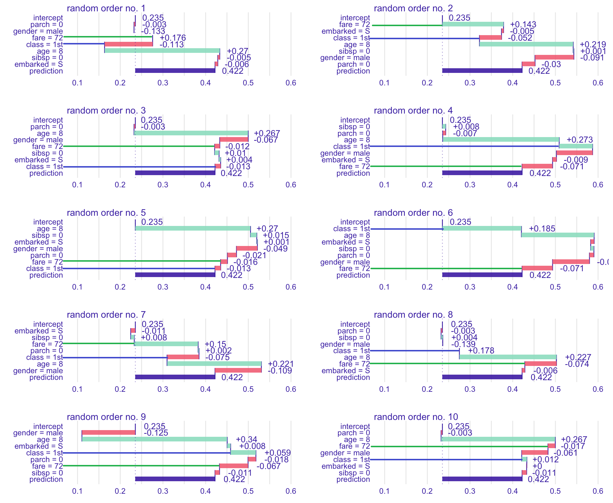
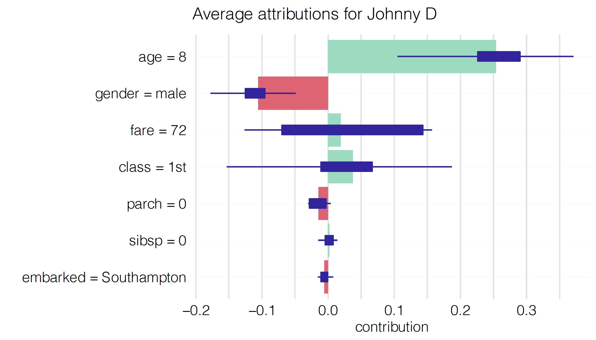

# Shapley Additive Explanations (SHAP) for Average Attributions

**Learning objectives:**

- Introduce another approach to **address the ordering issue** by **averaging the value of a variable's attribution** over all (or a large number of) possible orderings.

## Applying random order to BD plots {-}

**`fare` and `class` change a lot.**



## fare and class summary {-}


```{r, echo=FALSE,fig.align='center', fig.dpi=300}
library(ggplot2)
library(data.table)

FocusVars <- c("Fare","Class")

FocusVarsColors <- c("forestgreen", "blue")
names(FocusVarsColors) <- FocusVars

FareClassDt <-
  data.table(order = rep(1:10, 2),
             variable = factor(rep(FocusVars, each = 10),
                               levels = FocusVars),
             value = c(
               # fare
               0.176, 0.143, -0.012, -0.071, -0.016,
               -0.071, 0.015, -0.074, -0.067, -0.017,
               
               # class
               -0.113, -0.052, -0.013, 0.07, -0.013,
               0.185, -0.075, 0.178, 0.059, 0.012
             ) )

ggplot(FareClassDt, aes(order, value, color = variable))+
  geom_line()+
  geom_point(size = 2.5)+
  geom_hline(yintercept = 0,
             linetype = 5)+
  scale_x_continuous(breaks = scales::breaks_width(1))+
  scale_y_continuous(breaks = scales::breaks_width(0.05))+
  scale_color_manual(values = FocusVarsColors) +
  facet_wrap(~ variable, ncol = 1)+
  theme_minimal()+
  theme(strip.text = element_text(face = "bold", size = 12),
        axis.text = element_text(color = "grey53", size = 11),
        panel.grid = element_line(color = "grey90"),
        legend.position = "none",
        panel.grid.minor.x = element_blank())
```

## Mean value of the attributions {-}

To remove the influence of the ordering of the variables.

```{r, echo=FALSE, fig.align='center'}
FareClassDt[, .(mean_value = mean(value)),
            by = variable] |>
  flextable::flextable()
```





## Meeting Videos {-}

### Cohort 1 {-}

`r knitr::include_url("https://www.youtube.com/embed/URL")`

<details>
<summary> Meeting chat log </summary>

```
LOG
```
</details>
