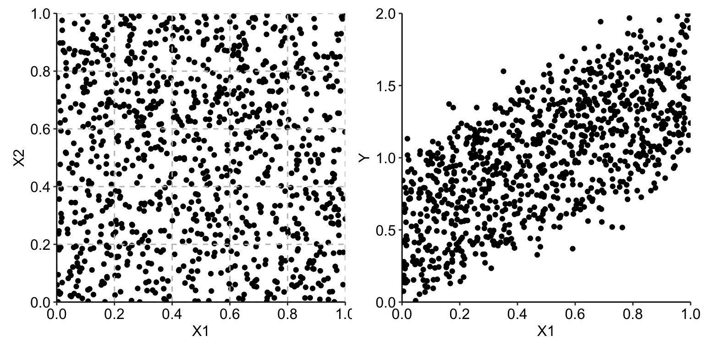
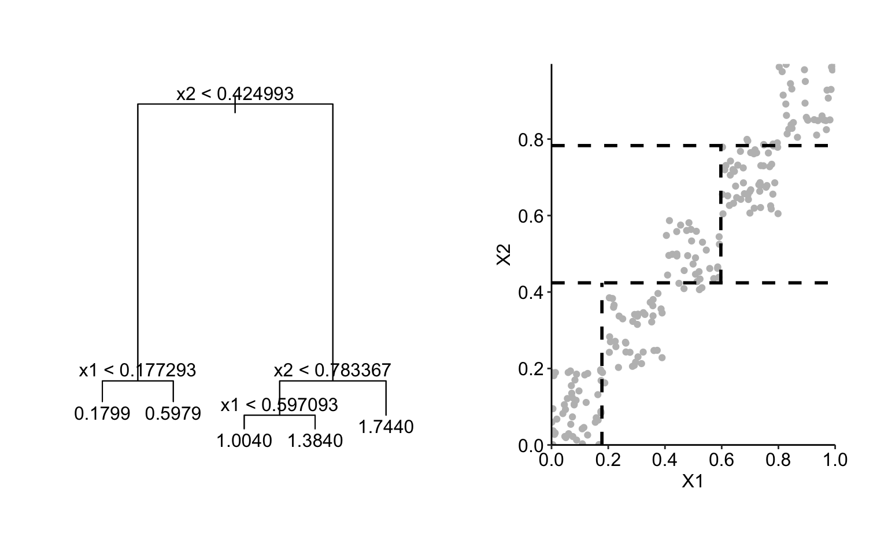

# Local-dependence and Accumulated-local Profiles

**Learning objectives:**

- THESE ARE NICE TO HAVE BUT NOT ABSOLUTELY NECESSARY

## Partial-dependence (PD) profiles {-}

**Pros**

- The mean of ceteris-paribus (CP) profiles
- Easy to explain and interpret

**Cons**

- They can be misleading if some dependent variable are **correlated**.
  - In the apartment-prices dataset, *surface* and *number of rooms* are **positive correlated**.
  - In the Titanic dataset, *fare* and *class* are **positive correlated**.
  
<br>

**Accumulated-local profiles address this issue**.


## Describing the problem - Linear Example {-}

Simple linear model with two explanatory variables

\begin{equation}
Y = X^1 +  X^2 + \varepsilon = f(X^1, X^2) + \varepsilon
\end{equation}

where $\varepsilon \sim N(0,0.1^2)$



## Describing the problem - Linear Example {-}

Simple linear model with two explanatory variables

```{r}
set.seed(21965)

x1 <- runif(1000)
x2 <- runif(1000)
ex <- rnorm(1000, mean=0, sd=0.1)
yx <- x1+x2+ex
```

Defining the group for each point.

```{r}
br <- c(0,.2,.4,.6,.8,1)
x1c <- cut(x1,breaks = br)
x2c <- cut(x2,breaks = br)
```


##  Describing the problem - Linear Example {-}

Creating a matrix of means for each combination.

```{r}
y_mean_matrix <-
  tapply(yx, list(x1c,x2c), mean) |>
  round(digits = 2)

y_mean_matrix
```

##  Describing the problem - Linear Example {-}

Counting the number of observations of each group.

```{r}
( count_matrix <- table(x1c, x2c) )
```


##  Describing the problem - Linear Example {-}

Counting the number of observations of each group of $X^1$.

```{r}
( x1_dist_matrix <- colSums(count_matrix) / sum(count_matrix) )
```

PD profile for $X^1$ (*expected value*).

```{r}
linear_profiles <- (y_mean_matrix %*% x1_dist_matrix) |> round(digits = 1)

colnames(linear_profiles) <- "profiles"

linear_profiles
```

##  Describing the problem - Linear Example {-}

We could describe the profile by the linear function $0.5+z$.

```{r}
linear_profiles |>
  transform(linear_mid_points = c(0.1, 0.3, 0.5, 0.7, 0.9)) |>
  transform(profile_aprox = 0.5 + linear_mid_points)
```


##  Describing the problem - Linear Example {-}

Let's now subset the values that fit in same groups for $X^1$ and $X^2$.

```{r}
same_group_df <- 
  data.frame(x1,x2,ex,yx,x1c,x2c) |>
  subset(x1c==x2c)
```

Now if we calculate the mean we have many missing values.

```{r}
same_group_y_mean_matrix <-
  with(same_group_df,
       tapply(yx, list(x1c,x2c), mean)) |>
  round(digits = 2)

same_group_y_mean_matrix
```

##  Describing the problem - Linear Example {-}

To make possible the calculation, we copy the value obtained for each range of $X^1$.

```{r}
same_group_y_mean_filled <-
  colSums(same_group_y_mean_matrix, na.rm = TRUE) |>
  matrix(nrow = 5, ncol = 5, byrow = TRUE)

same_group_y_mean_filled
```

##  Describing the problem - Linear Example {-}

Counting the number of observations of each group.

```{r}
same_group_count_matrix <- 
  with(same_group_df,
       table(x1c, x2c))

same_group_count_matrix
```


##  Describing the problem - Linear Example {-}

Counting the number of observations of each group of $X^1$.

```{r}
same_group_x1_dist_matrix <-
  colSums(same_group_count_matrix) /
  sum(same_group_count_matrix)

round(same_group_x1_dist_matrix, 2)
```

##  Describing the problem - Linear Example {-}

PD profile for $X^1$ (*expected value*).

```{r}
(same_group_y_mean_filled %*% same_group_x1_dist_matrix) |> round(digits = 2)
```

**Now, the obtained profile indicates no effect of X1**, which is not true.


##  Describing the problem - Tree Example {-}

The tree is **over estimating** $Y$ for $x^1 \in [0,0.2]$ and $x^2 \in [0.8,1]$ as it is projecting **1.74** where the true value of $Y$ is **1** the prior model could predict **0.99**.

```{r}
library(tree)

tree_model <- tree(yx ~ x1 + x2, data = same_group_df)
```





##  Describing the problem - Tree Example {-}

Defining the new breaks for $X^1$ based on the `tree` model.

```{r}
tree_x1_breaks <-
  tree:::labels.tree(tree_model) |>
  grep(pattern = "^x1", value = TRUE) |> 
  sub(pattern = "x1 (<|>) ", replacement = "") |> 
  as.double() |>
  unique() |>
  c(0, a = _ ,1) |>
  unname()

round(tree_x1_breaks, 2)
```

##  Describing the problem - Tree Example {-}

PD profile for $X^1$ for the regression `tree`.

```{r}
tree_pdp <-
  same_group_df |>
  transform(tree_hat = predict(tree_model),
            x1c_tree = cut(x1, tree_x1_breaks)) |>
  aggregate(x = tree_hat ~ x1c_tree,
            FUN = \(x) mean(x) |> round(digits = 1))

names(tree_pdp)[2] <- "profile"

tree_pdp
```

##  Describing the problem - Tree Example {-}

Based on the mid point of each break, we can approximate the profiles using the function $2z$, with a **slope larger than the true value of 1**.

```{r}
tree_pdp |>
  transform(tree_mid_point = c(0.1, 0.4, 0.8)) |>
  transform(profile_aprox = 2 * tree_mid_point)
```


## SLIDE 1 {-}

- ADD SLIDES AS SECTIONS (`##`).
- TRY TO KEEP THEM RELATIVELY SLIDE-LIKE; THESE ARE NOTES, NOT THE BOOK ITSELF.

## Meeting Videos {-}

### Cohort 1 {-}

`r knitr::include_url("https://www.youtube.com/embed/URL")`

<details>
<summary> Meeting chat log </summary>

```
LOG
```
</details>
