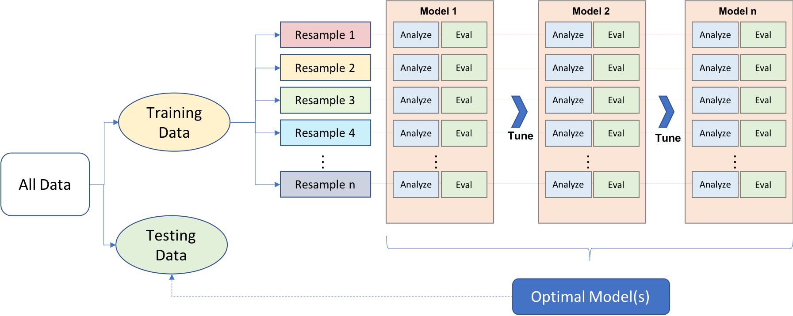

--- 
title: "Explanatory Model Analysis Book Club"
author: "The R4DS Online Learning Community"
date: "`r Sys.Date()`"
site: bookdown::bookdown_site
documentclass: book
bibliography: book.bib
biblio-style: apalike
link-citations: yes
github-repo: r4ds/bookclub-ema
description: "This website is the product of the R4DS Online Learning Community's Explanatory Model Analysis Book Club."
---

# Welcome {-}

Welcome to the Explanatory Model Analysis book club! 

This website is a companion for the book [_Explanatory Model Analysis_](https://ema.drwhy.ai/) by Przemyslaw Biecek and Tomasz Burzykowski (copyright 2021).

You can find this presentation is available at [r4ds.io/ema](https://r4ds.io/ema).

This website is being developed by the [R4DS Online Learning Community](https://rfordatasci.com). Follow along, and [join the community](https://r4ds.io/join) to participate.

This companion follows the [R4DS Online Learning Community Code of Conduct](https://r4ds.io/conduct).

## Book club meetings {-}

- Each week, a volunteer will present a chapter from the book after assigning its name in the [Volunteers Spreadsheet](https://docs.google.com/spreadsheets/d/1vGnIw4y2QydGYPjUrPJlToawhLpwDpRPj-yjPl2KZIQ/edit#gid=0)
  
-  Presentations: 
   -  Review of material
   -  Questions you have
   -  Maybe live demo
   
- More information about how to present is available in the [github.com/r4ds/bookclub-ema](https://github.com/r4ds/bookclub-ema).

- Presentations will be recorded, and will be available on the [R4DS Online Learning Community YouTube Channel](https://r4ds.io/youtube).

## Pace {-}

-  Meet ***every*** week except holidays, etc

-  Meetings = **1 hour.**

-  **Goal:** 1 chapter/week
  -  Ok to split overwhelming chapters
  -  Ok to combine short chapters
  
-  If we need to **slow down** and discuss, **let me know**.
   -  Most likely someone has the same question 
   -  We are all here to learn 
  
   
## Introductions {-}

If you feel comfortable sharing, unmute or raise your hand!

-  **Who** are you?
-  **Where** are you joining from?
-  **Previous clubs?** (R4DS or other)
-  **How long** have you been using R?
-  **What** are you most looking forward to learning?

## Before reading this book {-}

You should have some experience:

- Using R ([R for Data Science](https://r4ds.hadley.nz/)) or Python ([Python for Data Analysis](https://wesmckinney.com/book/))

- Training, re-sampling, evaluating, and tuning models by using packages like:
  - `CatBoost`
  - `LightGBM`
  - `XGBoost`
  - `Keras`
  - `H2O`
  - `Tidymodels` or `Scikit-learn`

## A note {-}
  
-  You are not expected to know everything.
   -  We are all learning.
   -  None of us is as smart as all of us.
   -  It's okay to say "I don't know."
   -  We can stop at anytime to discuss.

